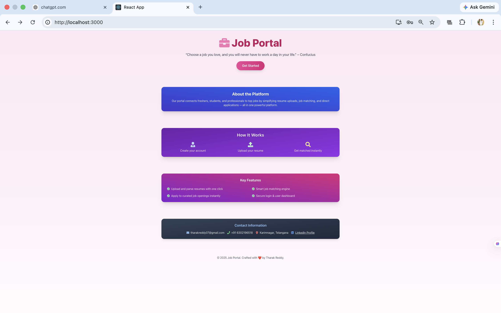
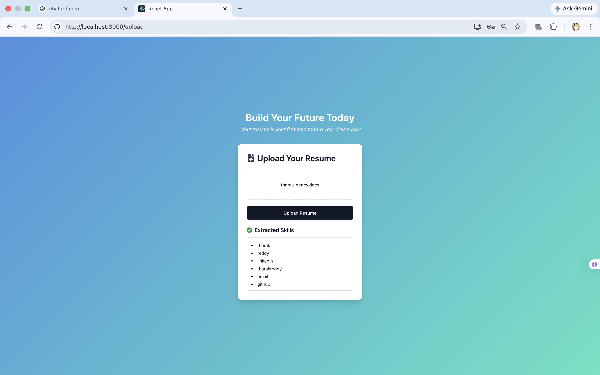
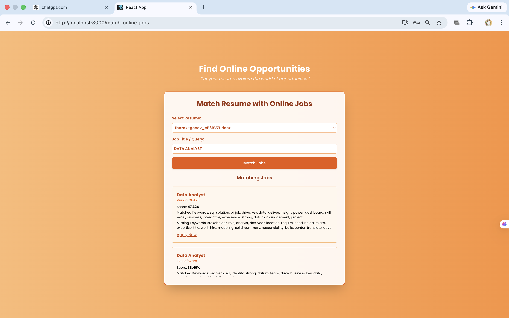
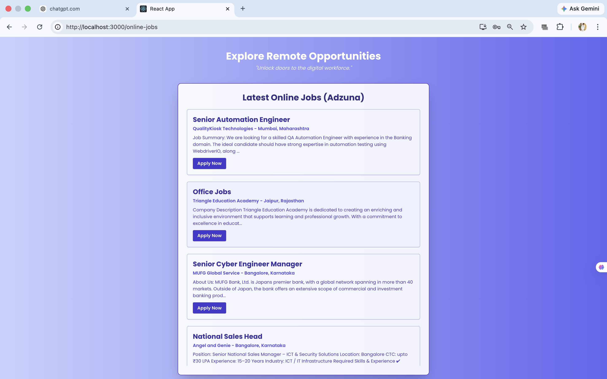

# AI Job Portal with Resume Matching

## Overview

This project is a full-stack AI-powered Job Portal that connects job seekers with recruiters.
Users can upload their resumes, explore job opportunities, and receive intelligent job recommendations based on their skills and profile.

---

## Features

* User Authentication (Login & Register)
* Resume Upload and Parsing
* Job Listings and Posting
* AI-Based Job Matching
* Match Score Generation
* Online Job Integration
* Dashboard for insights

---

## How It Works

1. User registers and logs into the system
2. Uploads resume (PDF/DOCX format)
3. Resume content is extracted using Python libraries
4. Job descriptions are stored in the database
5. Matching algorithm compares resume with job descriptions
6. System generates a match score and shows relevant jobs

---

## Tech Stack

* **Frontend:** React.js
* **Backend:** Django + Django REST Framework
* **Database:** SQLite
* **Libraries:** docx2txt, Python NLP techniques

---

## Screenshots

### Homepage


### Login Page


### Resume Upload


### Match Results


### Online Jobs


### Dashboard


---

## Run Locally

### Backend

```bash
cd backend
source venv/bin/activate
pip install -r requirement.txt
python manage.py runserver
```

### Frontend

```bash
cd frontend
npm install
npm start
```

---

## Future Enhancements

* Advanced NLP for better skill extraction
* Machine learning-based recommendation system
* Real-time job updates
* Deployment using cloud platforms

---

## Author

**Tharak Reddy**
📧 [tharakreddy07@gmail.com](mailto:tharakreddy07@gmail.com)
🔗 https://www.linkedin.com/in/tharak-reddy-287b3524a/
